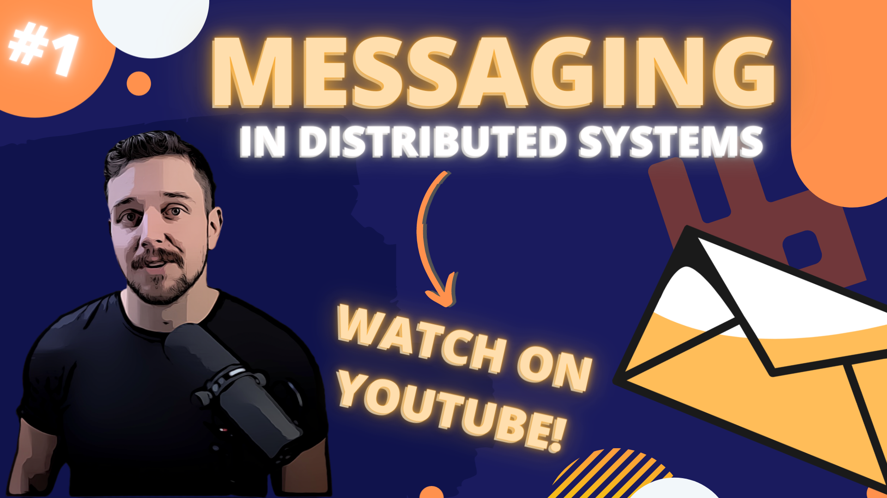

# Messaging In Distributed Systems
Code for all the messaging-related concepts/patterns described on YouTube during "Messaging in Distributed Systems" series.

# Episodes

The **implementation process** can be found on our [DevMentors YouTube](https://www.youtube.com/watch?v=dp5nqLnhZyE&list=PLqqD43D6Mqz0dxaC7kwvg0pUNY5mKHtrs&ab_channel=DevMentors) channel:
- [Episode 1: Microservices communication patterns, messaging basics](https://www.youtube.com/watch?v=eW4JgrkwWEM&ab_channel=DevMentors)

# Requirements

- [.NET 6.0 SDK](https://dotnet.microsoft.com/download/dotnet/6.0)
- [Docker](https://docs.docker.com/get-docker)

To start the infrastructure via Docker, type the following command at the `compose` directory:

`docker compose -f infrastructure.yml up -d`

Each application can be started separately using dotnet CLI or your favorite IDE.
